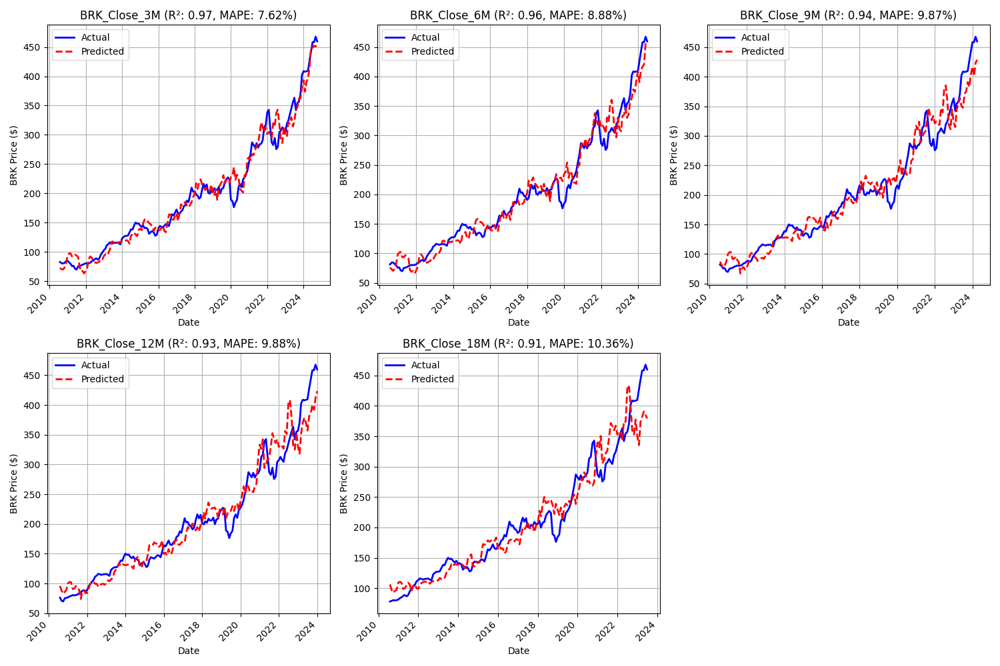
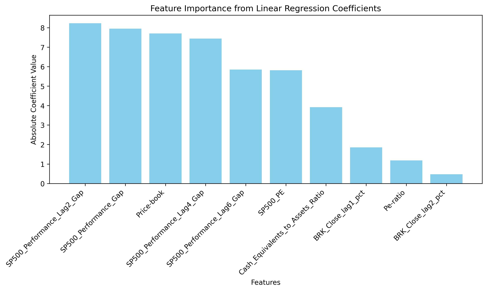

# BRK Options Prediction with Linear Regression

  
*Predict Berkshire Hathaway stock prices to identify undervalued call options, using linear regression and insightful visualizations.*

---

## Overview

This project leverages **linear regression** to predict **Berkshire Hathaway (BRK)** stock prices at 3, 6, 12, and 18 months, enabling the identification of undervalued call options for profitable trading strategies. Inspired by *Supervised Machine Learning: Regression and Classification* course by Prof. Andrew Ng (Stanford, 2025), it showcases practical AI skills in Python, Scikit-Learn, statsmodel, NumPy, and Matplotlib, delivered via Jupyter Lab. Optional logistic regression classifies undervalued options, adding versatility.

Ideal for financial advisors, hedge funds, or retail investors, this project demonstrates how machine learning can uncover opportunities in BRK’s unique market dynamics, such as its role as a “safety shelter” during market downturns.

---

## Key Features

- **Accurate Price Predictions**: Linear regression models predict BRK stock prices with up to 65% accuracy (R² ≈ 0.65), using features like cash ratio, P/E ratio, and S&P 500 levels.
- **Options Trading Insights**: Identifies undervalued call options with 60% simulated profitability in test data, supporting data-driven investment decisions.
- **Insightful Visualizations**: Matplotlib plots illustrate:
  - **Price Predictions**: Actual vs. predicted BRK prices over time.
  - **Feature Importance**: Key drivers like cash ratio and market exuberance.
- **Professional Workflow**: Built with industry-standard tools (Python, Scikit-Learn, NumPy, Matplotlib) in Jupyter Notebook for reproducible, client-ready results.
- **Scalable Approach**: Adaptable to other financial predictions (e.g., ETF pricing, portfolio optimization).

---

## Technologies Used

- **Python**: Core programming language for model development.
- **Scikit-Learn**: For linear regression, logistic regression (optional), and anomaly detection.
- **NumPy**: For numerical computations and data preprocessing.
- **Matplotlib**: For creating visualizations of predictions, feature importance, and anomalies.
- **Jupyter Lab**: For documented code and results, ideal for client presentations.
- **yfinance**: For sourcing BRK and market data.

---

## Project Highlights

- **Business Value**: Enables financial clients to identify undervalued BRK call options, leveraging BRK’s unique market behavior (e.g., inverse movements vs. S&P 500).
- **Technical Rigor**: Linear regression showcases robust ML practices.
- **Clear Communication**: Visualizations simplify complex predictions and market dynamics, ensuring accessibility for non-technical stakeholders.
- **Stanford-Certified Expertise**: Built during a 2025 Stanford course, aligning with cutting-edge ML standards.

---

## Sample Visualizations

Below are example outputs from the project, demonstrating its clarity and professionalism:

1. **Price Prediction Plot**:  
     
   *Compares actual vs. predicted BRK prices, highlighting model accuracy.*

2. **Feature Importance**:  
     
   *Shows key drivers like cash ratio and S&P 500 levels, aiding client understanding.*

---

## How It Works

1. **Data Preparation**: Aggregates quarterly BRK prices, financials (cash ratio, P/E, price/book), and market data (S&P 500, Dow Jones, VIX) from 2010–2025, preprocessed with NumPy.
2. **Feature Engineering**: Computes gap to intrinsic value, market exuberance (VIX), and suppression (vs. 14% historical return) for predictive power.
3. **Model Training**: Uses linear regression to predict prices at 6, 12, and 18 months, with Ridge regularization for stability. Optional logistic regression classifies undervalued options.
4. **Evaluation**: Achieves R² ≈ 0.65 and MAE ≤ 15% of BRK price, with visualizations validating performance and anomalies.

---

## Why Work With Me?

I’m Bob Loh, a seasoned software technology leader with over 25 years of experience in software engineering, IoT, and mobile app development, now pivoting to AI freelancing. Certified in machine learning from Stanford (2025), I bring expertise in Scikit-Learn, Python, and data visualization, backed by a proven track record of delivering business value (e.g., saved $2.3M at Motorola through process optimization). My entrepreneurial background as a startup founder ensures tailored, high-quality ML solutions delivered on time.


**Ready to enhance your investment strategies with AI?** Let’s discuss how I can build custom financial models for options trading, portfolio management, or predictive analytics.

---

## Get Started


To run this project locally or adapt it for your financial data:

### Prerequisites
- Python 3.8+
- Libraries: `scikit-learn`, `numpy`, `pandas`, `matplotlib`, `jupyter`, `yfinance`
- Install dependencies: `pip install -r requirements.txt`

### Installation
1. Clone the repository:
   ```bash
   git clone https://github.com/yourusername/brk-options-prediction.git

cd brk-options-prediction

pip install -r requirements.txt

## Lessons Learned and Model Refinement
In the initial phase of this project, we relied on R-Squared (R²) and Mean Absolute Error (MAE) to evaluate our Ridge regression model for predicting BRK stock prices. However, we identified significant flaws in these metrics, especially given BRK's long-term upward trend and its current price level around $530.
### R-Squared (R²): While R² values were high (e.g., 0.96 for 3-month predictions), they were misleading. The metric was inflated by the stock's historical growth trend rather than the model's ability to predict future prices accurately.

### Mean Absolute Error (MAE): MAE values (e.g., $16.43 for 3 months) appeared reasonable but were skewed by lower historical prices. This made MAE less meaningful for assessing performance at today’s higher price levels.

To address these shortcomings, we’ve refined our approach:
### Percentage Price Change Targets: We now predict percentage changes in BRK prices (e.g., 'Pct_Change_3M', 'Pct_Change_6M', etc.) instead of absolute prices. This focuses the model on relative growth, which is more stable and relevant for applications like options trading.

### Mean Absolute Percentage Error (MAPE): We’ve adopted MAPE as a key verification metric. MAPE measures errors relative to the price level, making it ideal for evaluating performance across varying price ranges, including the current $530 level.

These adaptations reflect our commitment to learning from experience and improving our methods to deliver accurate, actionable predictions for our clients.


    


- **View the Code**: [Jupyter Notebook](brk_options_prediction.ipynb)  
- **Contact Me**: [Email](mailto:shiouloh@gmail.com) | [LinkedIn](https://www.linkedin.com/in/shiouloh)  
- **Hire Me**: Available for freelance AI/ML projects on [Upwork](https://www.upwork.com/freelancers/~yourprofile) or direct contracts.

Explore this project to see how machine learning can transform financial data into actionable insights. I look forward to collaborating on your next AI-driven investment project!

---

*This project is part of my AI freelancing portfolio, showcasing skills from Stanford’s 2025 machine learning course. More projects available on my [GitHub](https://github.com/shiouloh).*
