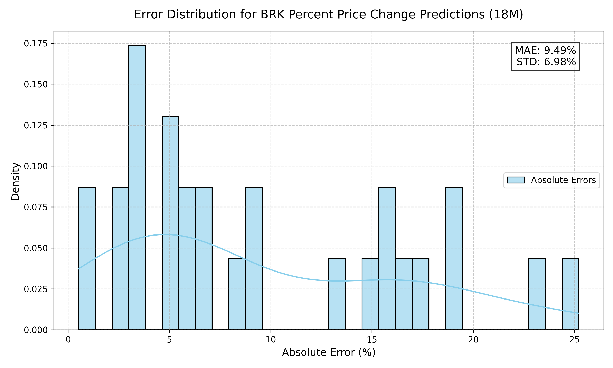

# BRK Price Prediction Using Machine Learning

<!-- -->


*Predict Berkshire Hathaway stock prices and returns to uncover undervalued call options, using advanced linear regression techniques and insightful visualizations.*

---

## Overview

This project harnesses **linear regression** and **Ridge regularization** to predict **Berkshire Hathaway (BRK)** stock prices and percent price changes at 3, 6, 9, 12, and 18-month horizons, enabling data-driven identification of undervalued call options for profitable trading strategies. Built on the *Supervised Machine Learning: Regression and Classification* course by Prof. Andrew Ng (Stanford, 2025), it showcases advanced AI skills in Python, Scikit-Learn, NumPy, Matplotlib, and Jupyter Lab.

Designed for financial advisors, hedge funds, and retail investors, the project delivers actionable insights into BRK’s unique market dynamics, such as its role as a “market buffer” during downturns. Rigorous analysis of model performance, feature stability, and non-linear effects demonstrates technical expertise and a client-focused approach to solving complex financial problems.

---

## Key Features

- **Robust Price and Return Predictions**: Linear regression and Ridge models predict BRK stock prices (R² up to 0.97 for absolute prices) and percent price changes (R² up to 0.57 out-of-sample), using features like cash-to-assets ratio, P/E ratio, price-to-book, and S&P 500 performance gaps.
- **Options Trading Insights**: Identifies undervalued call options by modeling BRK’s price movements and returns, tailored for strategic investment decisions.
- **Advanced Analysis**:
  - **Coefficient Stability**: Detailed evaluation of feature impacts (e.g., unstable `Pe-ratio`, stable `Price-book`), ensuring reliable predictions.
  - **Ridge Regularization**: Improves out-of-sample performance (e.g., R² from -0.02 to 0.06 for 6M percent changes) by mitigating overfitting.
  - **Non-Linear Exploration**: Proposes polynomial feature engineering to capture complex market buffer effects, planned as a future extension.
- **Insightful Visualizations**: Matplotlib plots illustrate:
  - Actual vs. predicted prices and returns.
  - Feature importance, highlighting drivers like cash reserves and market trends.
  - Error distributions for transparent model evaluation.
- **Professional Workflow**: Built with industry-standard tools (Python, Scikit-Learn, Jupyter Lab) for reproducible, client-ready deliverables, with table-of-contents navigation for ease of use.
- **Scalable Framework**: Adaptable for ETF pricing, portfolio optimization, or other financial predictions.

---

## Technologies Used

- **Python**: Core language for model development and analysis.
- **Scikit-Learn**: For linear regression, Ridge regularization, and polynomial feature engineering.
- **NumPy**: For numerical computations and data preprocessing.
- **Pandas**: For efficient data handling and feature engineering.
- **Matplotlib**: For creating visualizations of predictions, feature importance, and error analysis.
- **Jupyter Lab**: For documented, interactive code and results, ideal for client presentations.
- **yfinance**: For sourcing BRK and market data (e.g., S&P 500, VIX).

---

## Project Highlights

- **Business Value**: Empowers clients to capitalize on BRK’s unique behavior (e.g., stability in down markets) for options trading and portfolio management, with predictions achieving MAE as low as 5.85% for 6M returns.
- **Technical Excellence**: Demonstrates mastery of linear regression, regularization, and feature engineering, with in-depth analysis of model performance and coefficient stability.
- **Actionable Insights**: Clear visualizations and rigorous evaluations simplify complex predictions, making results accessible to non-technical stakeholders.
- **Stanford-Certified Expertise**: Grounded in Stanford’s 2025 ML course, ensuring alignment with cutting-edge standards.

---

## Sample Visualizations

1. **Price Prediction Plot**:  
     
   *Compares actual vs. predicted BRK prices, showcasing model accuracy.*

2. **Feature Importance**:  
     
   *Highlights key drivers like cash-to-assets ratio and S&P 500 performance.*

3. **Error Distribution**:  
     
   *Visualizes prediction errors to validate model reliability.*

---

## How It Works

1. **Data Preparation**: Aggregates quarterly BRK prices, financials (cash-to-assets, P/E, price/book), and market data (S&P 500) from 2010–2025, preprocessed with Pandas and NumPy.
2. **Feature Engineering**: Includes cash-to-assets ratio, P/E ratio, price-to-book, S&P 500 performance gaps, and lagged price changes, with planned polynomial terms to capture non-linear effects.
3. **Model Training**:
   - **Linear Regression**: Predicts absolute prices (R² up to 0.97) and percent changes (R² up to 0.66 in-sample).
   - **Ridge Regularization**: Enhances out-of-sample performance (e.g., R² 0.42 for 9M), with tuned alpha values.
   - **Train-Test Split**: Validates generalization on unseen data.
4. **Evaluation and Analysis**:
   - Achieves MAE ≤ 6.44% for 9M returns and R² up to 0.57 for 18M out-of-sample.
   - Analyzes coefficient stability (e.g., unstable `Pe-ratio`, stable `Price-book`) and proposes polynomial features for non-linear effects.
   - Visualizes actual vs. predicted values, feature importance, and error distributions.
5. **Future Extension**: Plans to implement polynomial feature engineering to model non-linear market buffer effects, enhancing prediction accuracy.

---

## Why Work With Me?

I’m **Bob Loh**, a seasoned technology leader with over 25 years of experience in software engineering, IoT, and mobile app development, now specializing in AI and machine learning. Certified in machine learning from Stanford University (2025), I combine technical expertise in Python, Scikit-Learn, and data visualization with a proven track record of delivering business value (e.g., saved $2.3M at Motorola through process optimization). As a former startup founder, I understand the importance of tailored, high-impact solutions delivered on time.

My analytical approach—evidenced by in-depth model evaluations and innovative feature engineering—ensures robust, client-ready ML solutions. Whether you need predictive models for options trading, portfolio optimization, or financial analytics, I’m equipped to drive your success.

**Ready to transform your investment strategies with AI?** Let’s collaborate to build custom ML solutions that deliver measurable results.

---

## Get Started

To explore or adapt this project for your financial data:

### Prerequisites
- Python 3.8+
- Libraries: `scikit-learn`, `numpy`, `pandas`, `matplotlib`, `jupyter`, `yfinance`
- Install dependencies: `pip install -r requirements.txt`

### Installation
1. Clone the repository:
   ```bash
   git clone https://github.com/bobloh/ML-portfolio.git
   cd ML-portfolio/predict-brk-linear

2. ```bash
   pip install -r requirements.txt
3. ```bash
   jupyter lab ModelsForBRK_LinearRegression.ipynb   
