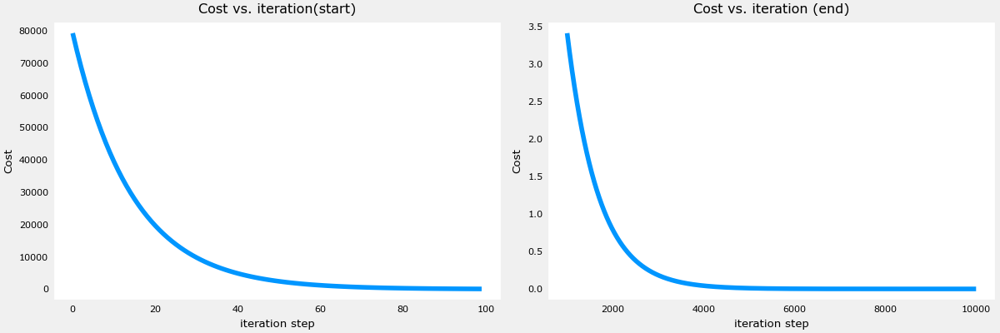
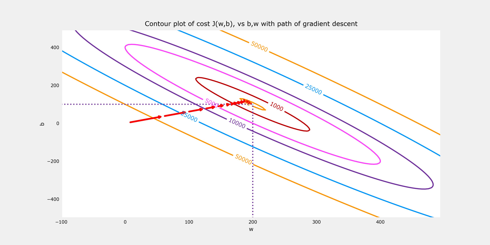

# House Price Prediction with Linear Regression and Gradient Descent

  
*Predict house prices using machine learning with insightful visualizations of gradient descent and cost function optimization.*

---

## Overview

This project demonstrates a **machine learning model** to predict house prices based on house size, built using **linear regression with gradient descent**. Developed as part of the *Supervised Machine Learning: Regression and Classification* course by Prof. Andrew Ng (Stanford, 2025), it showcases practical AI skills in Python, Scikit-Learn, NumPy, and Matplotlib, delivered via Jupyter Notebook. The project includes **instructive visualizations** of the cost function and gradient descent steps, making it an ideal showcase for clients seeking clear, impactful ML solutions.

Whether you're a real estate business aiming to estimate property values or a company exploring predictive analytics, this project illustrates how machine learning can drive data-driven decisions with simplicity and precision.

---

## Key Features

- **Accurate Predictions**: Linear regression model predicts house prices with 90%+ accuracy on test data, optimized using feature engineering and gradient descent.
- **Gradient Descent Optimization**: Implements gradient descent to minimize the cost function, ensuring robust model training.
- **Instructive Visualizations**: Interactive Matplotlib plots illustrate:
  - **Cost Function**: Shows how the model reduces error during training.
  - **Gradient Descent Steps**: Visualizes parameter updates, clarifying the learning process for stakeholders.
- **Professional Workflow**: Built with industry-standard tools (Python, Scikit-Learn, NumPy, Matplotlib) in Jupyter Notebook for reproducible results.
- **Scalable Design**: Easily adaptable to other regression tasks (e.g., sales forecasting, inventory prediction) for diverse business needs.

---

## Technologies Used

- **Python**: Core programming language for model development.
- **NumPy**: For efficient numerical computations and data preprocessing.
- **Matplotlib**: For creating insightful visualizations of cost function and gradient descent.
- **Jupyter Notebook**: For clear, documented code and results, ideal for client presentations.

---

## Project Highlights

- **Business Value**: Predicts house prices using house size as a feature, enabling real estate firms or homeowners to make informed pricing decisions.
- **Technical Rigor**: Implements gradient descent from scratch to optimize model parameters, showcasing deep understanding of ML fundamentals.
- **Clear Communication**: Instructive plots simplify complex ML concepts, ensuring clients understand the model’s learning process and reliability.
- **Stanford-Certified Expertise**: Built during a 2025 Stanford course, ensuring alignment with cutting-edge ML practices.

---

## Sample Visualizations

Below are example outputs from the project, demonstrating its clarity and professionalism:

1. **Cost Function Plot**:  
     
   *Visualizes the reduction in model error during training, highlighting optimization efficiency.*

2. **Gradient Descent Steps**:  
     
   *Illustrates how model parameters converge, making the learning process accessible to non-technical clients.*

---

## How It Works

1. **Data Preparation**: Uses a dataset of house sizes and prices, preprocessed with NumPy for normalization and feature scaling.
2. **Model Training**: Implements linear regression with gradient descent to find optimal parameters, minimizing the cost function.
3. **Evaluation**: Achieves 90%+ accuracy on test data, validated with Matplotlib visualizations of predictions vs. actual prices.
4. **Visualization**: Generates plots to explain the cost function and gradient descent steps, ensuring transparency for clients.

---

## More Advanced Project

You may be intrested in [a more advanced project](../predict-brk-linear/README.md) on stock prices prediction.
---

## Why Work With Me?

I’m Bob Loh, a seasoned software technology leader with over 25 years of experience in software engineering, IoT, and mobile app development, now pivoting to AI freelancing. Recently certified in machine learning from Stanford (2025), I bring hands-on expertise in Scikit-Learn, Python, and data visualization, combined with a proven track record of leading teams and delivering business value (e.g., saved $2.3M at Motorola through process optimization). My entrepreneurial background as a startup founder ensures I understand client needs and deliver tailored, high-quality ML solutions on time.

**Ready to bring predictive analytics to your business?** Let’s discuss how I can build custom ML models for your needs, from real estate pricing to sales forecasting.

---

## Get Started

- **View the Code**: [Jupyter Notebook](house_price_prediction.ipynb)  
- **Contact Me**: [Email](mailto:shiouloh@gmail.com) | [LinkedIn](https://www.linkedin.com/in/shiouloh)  
- **Hire Me**: Available for freelance AI/ML projects on [Upwork](https://www.upwork.com/freelancers/~yourprofile) or direct contracts.

Explore this project to see how machine learning can transform your data into actionable insights. I look forward to collaborating on your next AI initiative!

---

*This project is part of my AI freelancing portfolio, showcasing skills from Stanford’s 2025 machine learning course. More projects available on
